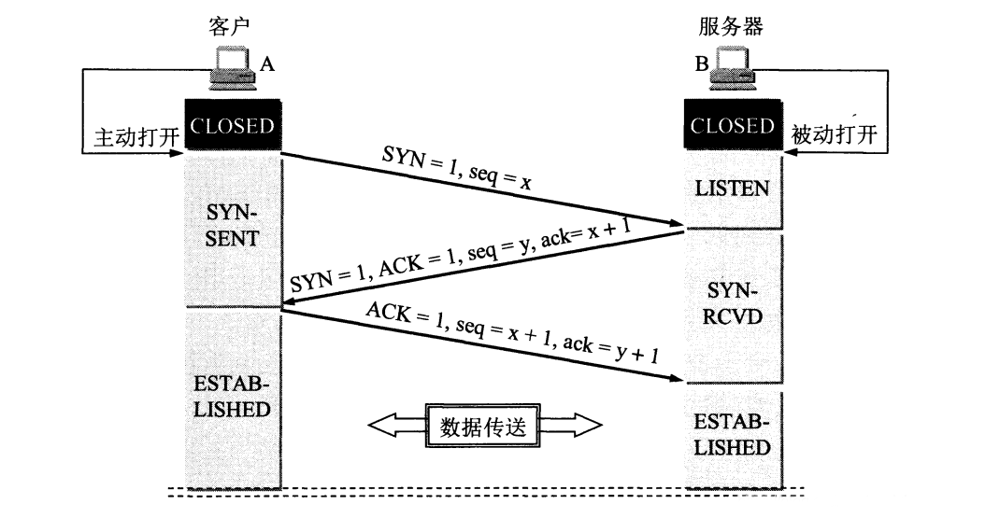
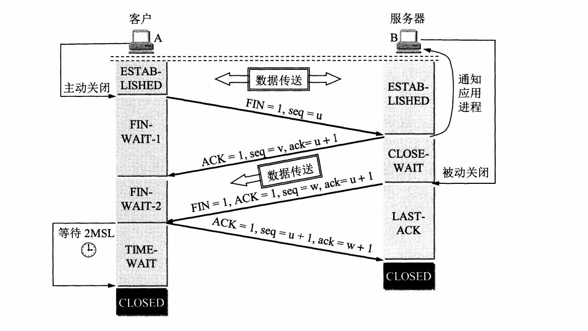
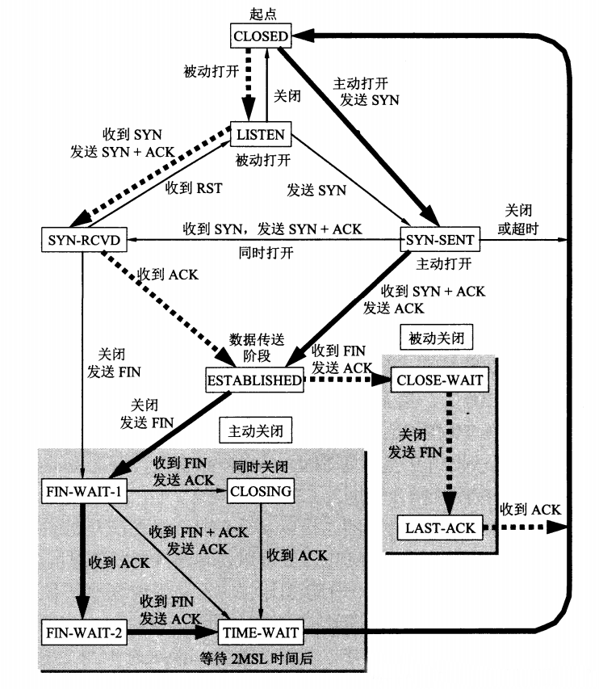

# TCP 三次握手与四次挥手

* [标识位](#标识位)
* [字段](#字段)
* [三次握手](#三次握手)
* [四次挥手](#四次挥手)
* [TCP 的有限状态](#tcp-的有限状态)

## 标识位

|   标识位    |                             含义                             |
| :---------: | :----------------------------------------------------------: |
| SYN（联机） |       该位为 1 时，表示发起一个连接请求或接受请求报文        |
| ACK（确认） | 该位为 1 时，表示确认应答  TCP 规定，在连接建立后所有报文的传输都必须把 ACK 设置为 1 |
| FIN（结束） | 该位为 1 时，表示该报文发送方的数据已经发送完毕，并要求释放连接 |

## 字段

| 字段 |  含义  |
| :--: | :----: |
| seq  | 序列号 |
| ack  | 确认号 |

## 三次握手

TCP 建立连接的过程叫作握手，握手需要在客户端和服务器之间交换三个 TCP 报文，以下就是 TCP 建立连接的三次握手。

1. 假设 A 运行的是 TCP 客户端程序，而 B 运行的是 TCP 服务端程序，两端最初的 TCP 进程都处于 `CLOSED` 状态。
2. B 的 TCP 进程首先创建传输控制块 TCB ，随后就处于 `LISTEN` 状态，准备接收来自 A 的连接请求。
3. A 的 TCP 进程也是首先创建传输控制块 TCB ，随后，在打算建立 TCP 连接时，向 B 发送连接请求报文，并将 `SYN` 设置为 1 ，同时选择一个初始序列号 `seq = x` 。此时， A 进入 `SYN-SENT` 状态。
4. B 收到连接请求报文后，如果同意建立连接，则向 A 发送确认，并将 `SYN` 和 `ACK` 都设置为 1 （确认号 `ack = x + 1` ），同时也为自已选择一个初始序列号 `seq = y` 。此时， B 进入 `SYN-RCVD` 状态。
5. A 收到确认后，还要向 B 发出确认，并将 `ACK` 设置为 1（确认号 `ack = y + 1` ），而自己的序列号 `seq = x + 1` 。此时， A 进入 `ESTABLISHED` 状态。
6. 当 B 收到 A 的确认后，也进入 `ESTABLESHED` 状态。此时，数据传送开始。

为什么不是两次握手？这主要是为了防止客户端已失效的连接请求报文突然又发送到服务端。

1. 考虑一种正常情况， A 发出连接请求，但因连接请求报文丢失而未收到确认，于是 A 再次发送连接请求，随即收到确认、建立连接、传输数据、释放连接。 A 总共发送了两个连接请求报文，其中第一个丢失，第二个到达了 B ，没有已失效的连接请求报文。
2. 现假设出现另一种异常情况，即 A 发出的第一个连接请求报文并没有丢失，而是在某些网络结点长时间滯留了，以致延误到第二个连接释放以后的某个时间才到达 B 。本来这是一个早已失效的报文，但 B 收到此失效的连接请求报文后，误认为是 A 又发出了一次新的连接请求，于是就向 A 回复确认报文，同意建立连接。假设不采用三次握手，那么只要 B 发出确认，新的连接就建立了，由于现在 A 并没有发出建立连接的请求，因此不会发送数据，但 B 却以为新的连接已经建立了，并且一直等待 A 发送数据，资源就这样白白浪费了。

## 四次挥手

握手后下个步骤是什么呢？分手吗？

TCP 释放连接的过程叫作挥手，挥手需要在客户端和服务器之间交换四个 TCP 报文，以下就是 TCP 释放连接的四次握手。

1. 数据传输结束后，通信的双方都可以释放连接，现假设 A 和 B 都处于 `ESTABLISHED` 状态， A 发出连接释放报文，并停止发送数据，随后， A 将连接释放报文中的 `FIN` 设置为 1 ，其序列号 `seq = u` （等于前面已传送数据最后一个字节的序列号加 1 ）。此时， A 进入 `FIN-WAIT-1` 状态，等待 B 的确认。
2. B 收到连接释放报文后发出确认，确认号 `ack = u + 1` ，其序列号 `seq = v` （等于前面已传送数据最后一个字节的序列号加 1 ） 。此时， B 进入 `CLOSE-WAIT` 状态。请注意，此时 TCP 连接处于半关闭状态，即 A 已经没有数据要发送了，如果 B 要发送数据， A 仍要接收，也就是说，从 B 到 A 这个方向的连接并未关闭，这个状态可能会持续一段时间。 A 收到来自 B 的确认后，就进入 `FIN-WAIT-2` 状态。
3. 现假定序列号 `seq = w` （半关闭状态下 B 又发送了一些数据），随后， B 将连接释放报文中的 `FIN` 设置为 1，同时重复上次已发送过的确认号 `ack = u + 1` 。此时， B 就进入 `LAST-ACK` 状态，等待 A 的确认。
4. A 在收到 B 的连接释放报文后，首先将确认报文中的 `ACK` 设置为 1 ，序列号 `seq = u + 1` ，确认号 `ack = w + 1` ，然后进入到 `TIME-WAIT` 状态。请注意，此时 TCP 连接还没有被完全释放掉，必须经过时间等待计时器设置的时间 2MSL 后， A 才进入到 `CLOSED` 状态。

为什么要必须等待 2MSL 的时间呢？主要有以下两个原因。

1. 保证 A 发送的最后一个确认报文能够到达 B 。由于这个确认报文可能丢失，导致处在 `LAST-ACK` 状态下的 B 收不到确认，随即 B 会启动超时重传，而 A 就能在 2MSL 时间内收到这个重传的报文，接着 A 重传确认，重新启动 2MSL 计时器，最后， A 和 B 都能正常进入到 `CLOSED` 状态。如果 A 在 `TIME-WAIT` 状态不等待一段时间， 而是在发送完确认报文后立即释放连接，那么就无法收到 B 重传的报文，这样 B 就无法按照正常步骤进入 `CLOSED` 状态。
2. 消除超时过期的报文。 A 在发送完最后一个确认报文后，再经过 2MSL 时间，就可以使本连接持续的时间内所产生的报文都从网络中超时过期，这样就可以使下一个新的连接中不会出现这种旧的报文。

## TCP 的有限状态

