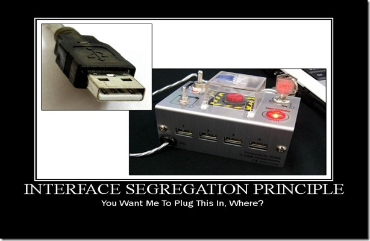

# SOLID

> S.O.L.I.D 是面向对象编程和面向对象设计的五个基本原则，应用这五个原则能创建一个易于维护和扩展的软件系统。 S.O.L.I.D 可以指导代码重构和在迭代的过程中进行代码清扫，以使得软件源代码清晰可读和具有良好的扩展性。在测试驱动开发中是典型应用场景，并且也是敏捷开发和自适应软件开发基本原则的重要组成部分。
>

* [单一功能原则（ S ）](#单一功能原则（-s-）)
* [开放封闭原则（ O ）](#开放封闭原则（-o-）)
* [里氏替换原则（ L ）](#里氏替换原则（-l-）)
* [接口隔离原则（ I ）](#接口隔离原则（-i-）)
* [依赖反转原则（ D ）](#依赖反转原则（-d-）)

## 单一功能原则（ S ）

> 让一个类只做一件事，如果需要承担更多的工作，那么分解这个类。

## 开放封闭原则（ O ）

> 类，模块，函数等应当对扩展开放，对修改闭合。

## 里氏替换原则（ L ）

> 当一个子类的实例应该能够替换任何其父类的实例时，它们之间才具有 IS-A 关系。

## 接口隔离原则（ I ）

> 不要强迫客户端去依赖那些他们不使用的接口。

## 依赖反转原则（ D ）

> 高层模块不应该依赖底层模块，两者都应该依赖其抽象。
>
> 抽象不应该依赖于细节，细节应该依赖于抽象。